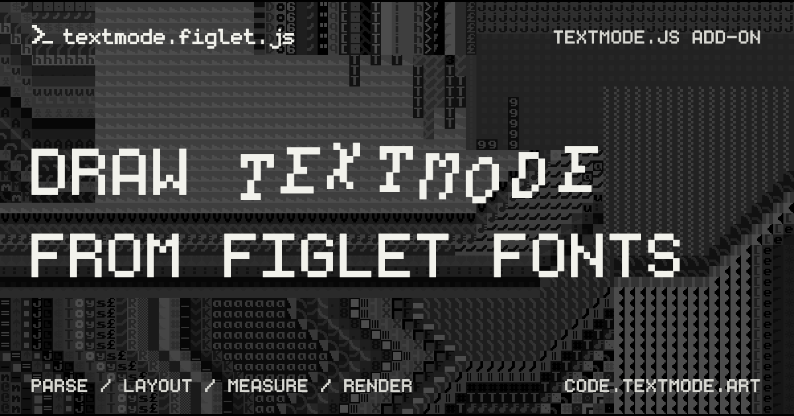

# textmode.figlet.js (✿◠‿◠)

<div align="center">



<table>
	<tr>
		<td align="center">
			<a href="https://www.typescriptlang.org/"></a>&nbsp;<a href="https://vitejs.dev/"></a>&nbsp;<a href="http://www.figlet.org/"></a>
		</td>
		<td align="center">
			<a href="https://code.textmode.art/"></a>&nbsp;<a href="https://discord.gg/sjrw8QXNks"></a>
		</td>
		<td align="center">
			<a href="https://ko-fi.com/V7V8JG2FY"></a>&nbsp;<a href="https://github.com/sponsors/humanbydefinition"></a>
		</td>
	</tr>
</table>

</div>

`textmode.figlet.js` is an add-on library for `textmode.js` that provides FIGlet / FIGfont support. It includes a FIGfont parser, layout engine, and rendering API that integrates with the `Textmodifier` system in `textmode.js`, allowing you to draw FIGlet text with configurable layout behavior and measurement helpers.

## Features

- Parse raw `.flf` sources into reusable `TextmodeFigFont` instances
- Load FIGfonts at runtime with `loadFigFont()`
- Draw FIGlet text with configurable horizontal and vertical layout behavior
- Measure rendered output with width, height, and bounds helpers before drawing
- Store alignment and baseline preferences per `Textmodifier` instance

## Try it online first

Open [editor.textmode.art](https://editor.textmode.art/), a browser-based live-coding environment for the
complete official `textmode.js` ecosystem. Sketches run as you edit, with no local toolchain required.

The editor includes `textmode.js` and all four official add-ons: `textmode.export.js`, `textmode.filters.js`,
`textmode.figlet.js`, and `textmode.synth.js`.

- Write with Monaco-powered completions, hover documentation, and diagnostics.
- Start with a blank sketch, an included example, or a community gallery sketch.
- Keep code and preferences saved in the browser, then share sketches through URL-based links.
- Use microphone or line-input analysis for audio-reactive work, and create on desktop or mobile.

Use it to load and render FIGlet fonts while you iterate on a sketch.

## Installation

Follow the [official installation guide](https://code.textmode.art/docs/installation) to install
`textmode.figlet.js` alongside `textmode.js` with npm or browser-ready UMD bundles.

## Plugin setup

```ts
import { textmode } from 'textmode.js';
import { FigletPlugin } from 'textmode.figlet.js';

const t = textmode.create({
	width: 800,
	height: 600,
	plugins: [FigletPlugin],
});
```

Importing `textmode.figlet.js` provides the TypeScript augmentation. The plugin installs the FIGlet drawing
and measurement API during setup and removes it again if the plugin is uninstalled.

## Loading `.flf` fonts

```ts
const bulbhead = await t.loadFigFont('https://cdn.jsdelivr.net/gh/xero/figlet-fonts@master/Bulbhead.flf');

t.figFont(bulbhead);

const custom = t.parseFigFont('Custom', figFontSource);
```

Any CORS-enabled `.flf` URL works for runtime loading.

## Drawing and measuring text

```ts
t.figTextAlign('center');
t.figTextBaseline('center');

t.figText('HELLO', 0, 0, {
	horizontalLayout: 'fitted',
});

const width = t.figTextWidth('HELLO');
const height = t.figTextHeight('HELLO');
const bounds = t.figTextBounds('HELLO');
```

Use the measurement helpers when you need to position FIGlet text precisely before rendering it.

## Alignment and baseline

- `figTextAlign('left' | 'center' | 'right')`
- `figTextBaseline('top' | 'center' | 'baseline' | 'bottom')`

These settings are stored in plugin-owned state per `Textmodifier` instance and apply to subsequent `figText()` calls until changed.

## Next steps

Visit the `textmode.js` documentation at [code.textmode.art](https://code.textmode.art/) for broader library guides and API reference, then use the local examples in this package to validate your FIGlet setup and rendering behavior.

## License

`textmode.figlet.js` is licensed under the [MIT License](./LICENSE).

---

<div align="center">

<br />

**[↑ back to top](#textmodefigletjs-%E2%80%BF)**

</div>
